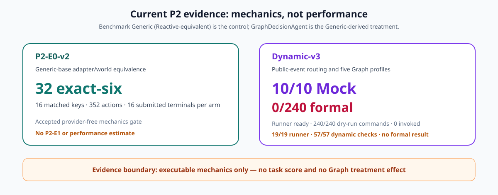

# Graph-Guided PHM Agents for Long-Horizon Diagnostic Rollouts

## Abstract

Reactive tool-use agents can repeat analyses, lose track of unresolved hypotheses, or submit prematurely during long PHM workflows. This paper studies a graph-guided PHM agent whose implementation defines eight explicit decision states—Inspect, Hypothesize, Analyze, Check, Monitor, Revise, Recover, and Submit—over the same Benchmark Generic LLM base and computational tools as the control. The control is Benchmark Generic (Reactive-equivalent), implemented by `ReactiveSequentialAgent` with zero behavior overrides. The active v6 primary registers no `public_condition_event`, so Monitor and Revise are unreachable there and only the six base-route states can be observed. A separate Generic-base dynamic-v3 profile makes observation-conditioned Monitor/Revise routing executable and registers target-adverse assigned-window Average Precision as its primary endpoint. Its unchanged 10-cell v2 Mock mechanics gate is accepted, while formal coverage is 0/240. The evaluation holds the base prompt, model, runtime, data, tools, numerical experts, budget, evaluator, and episode order fixed. Cold-start diagnosis and normal-only anomaly detection provide task-primary core outcomes; replay monitoring treats completion, recovery, stability, latency, and cost as explanatory outcomes. Formal treatment findings will follow the complete matched real-data cohorts.

## 1. Introduction

Long diagnostic rollouts require more than choosing individually valid tools. An agent must retain its current hypothesis, decide whether a result supports or contradicts that hypothesis, avoid repeating an unproductive operation, recover from errors, and recognize when evidence is sufficient for submission. A purely reactive policy may encode these decisions implicitly in conversation history, leaving state transitions implicit and harder to audit.

This paper isolates the effect of explicit decision structure. The control is the Benchmark Generic policy; `ReactiveSequentialAgent` is its zero-behavior-override wrapper and is therefore Reactive-equivalent rather than a separate learned or prompted agent. `GraphDecisionAgent` is derived directly from the same Generic base and adds the eight-state decision control. Neither production arm imports P1 runtime code. No additional data, operator, model expert, prompt budget, or evaluator capability is introduced. Graph states are recorded in the shared trajectory and must affect actual next-action selection.

GraphDecisionAgent is deliberately a finite-state control policy; state-machine workflow structure is not the claimed novelty. The research object is a registered matched PHM intervention: deterministic state derived only from public Benchmark trajectory fields, state-specific visibility over the unchanged tool catalog, a zero-override Generic control, condition-event and topology ablations, and task scoring by an independent evaluator. The graph constrains high-level state and legal actions while the shared LLM policy still chooses the within-state tool trajectory.

The primary hypothesis is that graph guidance improves replay-monitoring task performance under the shared fixed action budget. The primary estimand is $\Delta^{\mathrm{replay}}_{AP}=AP^{\mathrm{Graph}}-AP^{\mathrm{Generic}}$ over 24 exact episode pairs (eight rotation-0 bearings crossed with three seeds), stored as `estimate.online_replay_monitoring.task.average_precision` in the paired result. The frozen target-adverse missing-score policy keeps all 72 assigned replay windows per arm in the AP population: an omitted positive is a miss and an omitted negative receives an adverse false-alarm rank. The 95% interval uses 2,000 bearing-clustered paired bootstrap resamples. We report the estimate and interval without a significance threshold or non-inferiority margin. Grounded completion, recovery, repeated actions, budget exhaustion, latency, and cost are prespecified explanatory outcomes. Diagnosis Macro-F1 and anomaly completion-adjusted AP are task-primary core outcomes reported separately from the replay primary.

## 2. Related Work

ReAct interleaves reasoning and environment actions so an agent can update plans and handle exceptions [@yao2023react], while Reflexion uses linguistic feedback and episodic memory to influence subsequent trials [@shinn2023reflexion]. AgentBench shows that long-horizon reasoning and decision-making remain common failure sources across interactive environments [@liu2023agentbench]. The registered object here retains the Generic ReAct-style base but makes the treatment's current decision state, legal transitions, and state-specific tool visibility explicit in the shared rollout.

TimeART trains a tool-using model on expert time-series tool trajectories [@wu2026timeart], while TimeSage-MT evaluates structured, skill-guided and code-enabled agents over 240 multi-turn tasks across eight domains [@kong2026timesagemt]. PHMForge further motivates execution-trace evaluation in PHM-oriented tool environments [@das2026phmforge]. The present comparison fixes the Generic base prompt and every computational capability and varies only the registered eight-state control.

Industrial agents provide two closer control-structure references. ReActXen augments a ReAct executor with Review, Reflect, and Distillation components plus a Tiny Trajectory Store for structured SCADA queries [@rayfield2025reactiot]. CodeReAct embeds executable Python in a Thought--Action--Observation loop over structured maintenance records and evaluates outer-loop reflection and adaptive temperature [@zhou2026codereact]. P2 introduces none of those treatment-only roles or executable capabilities: `GraphDecisionAgent` remains one Generic-derived policy whose added state is computed from the public Benchmark trajectory.

StateFlow is the direct state-machine precedent. It models LLM task solving as a state machine, separates process grounding through states and transitions from actions within a state, and permits rule- or LLM-selected transitions over context history [@wu2024stateflow]. P2 therefore does not claim state-machine workflow formalism as new. It studies a narrower experimental question in PHM: whether deterministic public-rollout state and state-specific tool visibility change independently evaluated task outcomes when the Generic base, computational world, budget, and episode order are matched.

SPIRAL is the closest verified search-based planning comparison. It formalizes tool-use planning as state-space search and places Planner, Simulator, and Critic roles inside an MCTS loop; its Simulator predicts plausible next observations and its Critic supplies reflective feedback [@zhang2026spiral]. The P2 graph is a different intervention: it never searches predicted outcomes and adds no simulator, critic, or tree search. Its eight states and legal tool subsets are derived deterministically from actions and observations already recorded by the shared Benchmark environment.

Table 1 freezes these source-bounded distinctions. It is a structural comparison, not a numerical ranking, and imports no reported result from another task. The versioned table asset is `paper/assets/tables/graph_closest_work.md`.

| Work | Documented decision structure | Documented state or grounding source | Relation to the registered P2 contrast |
|---|---|---|---|
| ReAct [@yao2023react] | interleaved reasoning and environment actions | model trajectory and returned observations | P2 retains the Generic base and makes treatment state plus legal tool visibility explicit |
| ReActXen [@rayfield2025reactiot] | ReAct executor with Review, Reflect, and Distillation components and a Tiny Trajectory Store | structured SCADA query results plus curated in-context trajectories | P2 uses one Generic-derived treatment and no treatment-only auxiliary agent or trajectory store |
| StateFlow [@wu2024stateflow] | finite-state-machine-derived workflow whose states execute predefined prompt, model, or tool output functions | current state abstracts cumulative context history; rules or an LLM select transitions | direct formalism precedent; P2 does not claim state-machine workflows as novel and instead isolates public-rollout state plus state-specific tool visibility in a matched PHM evaluation |
| CodeReAct [@zhou2026codereact] | executable Python inside a Thought--Action--Observation loop with outer-loop reflection | structured Business Objects, analytic functions, alerts, and work orders | P2 adds an eight-state tool-visibility controller, not executable Python or adaptive model control |
| SPIRAL [@zhang2026spiral] | Planner/Simulator/Critic roles embedded in MCTS | Simulator-predicted observations and Critic feedback guide search | P2 derives state from observed Benchmark rollout events and performs no outcome simulation or tree search |
| PHMForge [@das2026phmforge] | PHM-oriented tool orchestration and execution traces | heterogeneous scenario-specific tools and data | P2 holds the Generic Benchmark world fixed and varies only graph control |
| GraphDecisionAgent (this work) | eight deterministic states with declared legal transitions and state-specific views of the unchanged tool catalog | public actions, execution results, errors, budget, and optional public condition events in the canonical rollout | active v6 exposes six reachable base-route states; dynamic-v3 retains an accepted 10-cell Mock mechanics gate, a runner-ready provider-free schedule, and formal coverage 0/240 |

## 3. Graph-Guided Policy

The implemented policy uses eight states. Inspect exposes only bounded data tools. Hypothesize exposes catalog-level operator/model discovery. Analyze exposes signal operators and model schemas. Check exposes numerical prediction and verification actions. Monitor represents a registered public equipment- or data-condition observation, and Revise replans after such an observation. Recover follows a recorded error and exposes the tools needed for one corrected call. Submit exposes only the terminal tool. State is derived from the public trajectory before each decision and is written to the resulting `TrajectoryStep`; it therefore changes both the model's policy context and the set of callable tools. The current registered v6 primary supplies no `public_condition_event`, so Monitor/Revise are unreachable, zero visitation is valid, and this cohort supports no dynamic-revision claim. Its declared transition relation is the 50-edge base-v6 relation used for primary treatment-integrity validation. Observation-conditioned behavior is isolated in a separately preregistered dynamic-full profile with its own 33-edge legal relation; that profile's provider-free mechanics gate is accepted but its formal cohort has not run. The Benchmark owns only generic public-condition event delivery; P02 owns the Graph-state interpretation.

Let $h_t$ be the public trajectory before turn $t$, $g(h_t)$ the deterministic state function, and $\mathcal{T}$ the unchanged shared tool set. The treatment action set is

$$
\mathcal{A}_t^{\mathrm{graph}} = \mathcal{T} \cap \mathcal{A}(g(h_t)),
$$

and its decision is sampled from the same Generic-base model policy as the control:

$$
a_t \sim \pi_\theta(a \mid q,h_t,\mathcal{A}_t^{\mathrm{graph}},g(h_t)).
$$

The Benchmark Generic (Reactive-equivalent) control receives $\mathcal{T}$ without $g$ or the state-specific filter. Thus graph guidance consists of two coupled, predeclared policy operations: exposing the current public decision state in the prompt and restricting the callable schemas to that state's subset. It does not add a computation, prediction, memory store, or private observation.

Transitions are a deterministic function of public trajectory fields: successful tool families, the most recent error, the current ordered replay sample, the number of successful feature calls whose public `source_sample_id` matches that sample, and the set of distinct replay samples with a successful sample-bound prediction. Under the v6 runtime contract, every successful `op.run` result inherits this opaque handle from its source artifact, including chained operator outputs. The same contract linearly interpolates the PSD value at each exact requested low- and high-Hz `band_power` endpoint before trapezoidal integration. The public task observation, tool results, and policy history contain no bearing identifier or target; `bearing_id` exists only in evaluator-side experiment records for split alignment and bearing-clustered inference. Repeating a prediction for one sample, or analyzing a different sample, therefore cannot advance the current sample's graph state. The graph does not read a private target, estimate an unrecorded uncertainty, perform numerical signal processing, or change the shared tool surface. A minimal runtime can implement these transitions directly; dependency on a particular graph framework is not part of the method.

### 3.1 State semantics and tool visibility

| State | Public condition | Tool families exposed |
|---|---|---|
| Inspect | current sample has no successful bounded read | `data.*` |
| Hypothesize | signal exists but analysis/model families have not been listed | catalog discovery and summary |
| Analyze | a catalog has been inspected but the core model schema is not yet available, or the current replay sample has fewer than 11 successful feature calls | operator list/schema/run and model schema |
| Check | the core model schema is available without a prediction, or the current replay sample has accumulated 11 successful feature calls | operator/model schema and prediction |
| Monitor | separate dynamic profile only: the current released sample carries a new public `operating_condition_change` pulse | bounded data, operator, and model analysis/prediction tools |
| Revise | separate full dynamic profile only: the next non-error, non-event observation follows Monitor | bounded data, operator, and model analysis/prediction tools |
| Recover | the previous recorded step failed | the tools needed for one corrected data/operator/model call |
| Submit | a core prediction exists, or replay has one successful prediction whose `source_sample_id` matches every ordered sample | terminal `submit` only |

The state is derived from public trajectory fields immediately before an LLM decision. `GraphDecisionAgent.available_tools` then filters the same benchmark schemas using the active state, and the shared runner records an out-of-state tool selection as a recoverable failed action rather than executing it. Either operator-catalog or model-catalog inspection advances Hypothesize to Analyze, so every catalog exposed in that state has a declared successor. For replay, a successful prediction advances to Inspect for the next ordered sample; after the final prediction it advances to Submit. A failed grounded-submission check advances from Submit to Recover so the Agent can correct its supporting artifacts. The graph neither edits a tool result nor supplies an action on behalf of the LLM.

### 3.2 Transition evaluation

Every `TrajectoryStep` stores the decision state used for that action. Transition validity is the fraction of adjacent observed states that belong to the declared transition relation; an episode with no observed state receives 0, while a one-state episode with no illegal transition receives 1. State coverage, per-state step occupancy, per-state episode visitation, Recover visits, repeated actions, grounded completion, and budget exhaustion remain separate measurements; they are not compressed into a graph score. A valid transition does not imply a useful action, which is why task outcomes are primary and rollout diagnostics remain explanatory.

For the non-empty observed state sequence $(s_1,\ldots,s_n)$ and declared edge relation $E$, transition validity is

$$
V_{\mathrm{trans}} =
\begin{cases}
1, & n=1,\\
\frac{1}{n-1}\sum_{t=1}^{n-1}\mathbf{1}[(s_t,s_{t+1})\in E], & n>1.
\end{cases}
$$

An empty sequence receives 0 because it provides no evidence that the treatment entered the runtime. During replay, a successful prediction advances the state to Inspect for the next ordered sample, while the already discovered operator/model catalogs remain public trajectory knowledge. After the final numerical prediction, the state advances to Submit. These rules make cross-window persistence observable without introducing an external graph memory.

For task $q$, episode state sequences $(s_{i1},\ldots,s_{iT_i})$, and declared state $s$, step occupancy and episode visitation are

$$
O_{q,s}=\frac{\sum_i\sum_{t=1}^{T_i}\mathbf{1}[s_{it}=s]}{\sum_i T_i},
\qquad
V_{q,s}=\frac{1}{N_q}\sum_i\mathbf{1}[\exists t:s_{it}=s].
$$

Occupancy is a proportion of recorded decision steps, not wall-clock time. Both diagnostics are reported for all eight executable states, including zero-valued states. Because the registered v6 primary has no `public_condition_event`, zero Monitor/Revise values are expected to remain admissible and must not be interpreted as evidence of dynamic revision.

## 4. Controlled Evaluation

The control and treatment use the identical Benchmark Generic base prompt, model runtime, task instances, tools, numerical experts, budgets, and stochastic seeds. The control is reported as Benchmark Generic (Reactive-equivalent); `ReactiveSequentialAgent` changes no Generic behavior. `GraphDecisionAgent` adds only the registered current-state prompt suffix and state-specific visibility over the same global tool catalog. The only varied factor is whether decision state is implicit/Generic or explicit/graph-guided.

Core diagnosis and anomaly comparisons use the Paderborn bearing dataset [@lessmeier2016conditionMonitoring] with all four bearing-grouped rotations, the sample at metadata-order index $\lfloor 2(n-1)/3 \rfloor$ from each of the 32 held-out bearings, and three paired seeds. These formal records are distinct from the exact midpoint records used during pre-formal endpoint and feature-contract development. Every bounded read contains all 8,192 samples from channel index 2, the bearing-housing vibration column mapped by the public upstream reader; the shared full-rate window contract prevents the material high-frequency aliasing identified by the benchmark sampling audit. Replay stress uses the eight held-out bearings in rotation 0, three ordered windows per bearing, and the same seeds. Fold-level expert/reference fitting and validation selection occur before the matched episodes and are identical across policies; the reported cost comparison therefore covers inference rollouts only. Core episodes have a 33-call budget; replay episodes allow 72 calls, three reads, 50 operator calls, and three model calls. These limits are shared by the Benchmark Generic and Graph arms.

The extension protocols remain at provider-free readiness. Horizon-v3 projects the dynamic-v3 target-adverse endpoint and matched bearing-cluster inference over 144 units; its validate-only schedule emits 144/144 dry commands with zero executions. Reliability-v2 registers 80 matched pairs/160 episode bundles; its dry schedule emits 160/160 inert commands, invokes none, and performs zero provider calls and writes. Its dedicated wrapper serializes provider execution for the whole reliability profile, uses collision-free temporary files, and preserves stamped attempts. Its analyzer makes target-adverse replay Average Precision primary: each repeat recomputes AP over all 24 assigned windows from registered private DataPort targets and canonical rollout submit prefixes, while grounded pass@1 and pass-all-10 remain explanatory. The analyzer rejects the legacy hyphenated attempt layout and excludes derived `evaluation.jsonl` rows from target and prediction authority. The accepted-result consumer rechecks all 160 bundles, 80 pairs, the protocol-bound formal root, ten repeat-level task-primary deltas, pass projections, selected rollout/cost outcomes, and valid bootstrap counts. Its publisher rejects undeclared paths, aliases, nonordinary existing outputs, source or parent symlink escapes, and protected input roots; the production CLI fixes the active protocol. It fully stages and fsyncs all three products, preserves file modes, and restores replaced files in reverse order after a failure. Runner/analyzer/scheduler checks pass 12/12, consumer checks pass 20/20, and the consumer has emitted zero rows.

Cross-dataset-v3 registers the accepted Ottawa ordered-state target and CSV DataPort; its provider-free preflight emits 18/18 commands for 72 episode bundles, 36 matched pairs, and 216 assigned windows. Its accepted-only analyzer independently rebuilds private assignments, requires 36 exact pairs before a 2,000-resample bearing-clustered analysis, and emits result schema v2 with a canonical run root equal to the scheduled base plus formal stamp. Its accepted-result consumer rechecks that provenance, the 72-bundle/36-pair gate, 108 assigned windows per arm, displayed task deltas, and physical-bearing bootstrap metadata. The publisher rejects undeclared paths, aliases, nonordinary existing outputs, source or parent symlink escapes, and raw/result-root publication before its mode-preserving grouped replacement; the production CLI fixes the active protocol. The prior chain passes 22/22 and the consumer passes 18/18. No P2-E8 command or result exists; provider execution awaits explicit destination and payload-egress authorization, and accepted analysis/publication requires the complete cohort.

The dynamic-v3 protocol retains horizons 3, 6, and 12 plus the full and four ablation profiles. Its accepted-only analyzer reconstructs the eight evaluator-private 12-window masters through the registered Paderborn DataPort, projects exact h3/h6 prefixes across every seed and arm, and reads predictions from canonical rollout successful-submit prefixes; runner-derived `evaluation.jsonl` is excluded from target and prediction authority. Its accepted result carries the opaque seed/sequence projections needed to reproduce secondary paired-cluster arithmetic. The consumer binds result and acceptance to the protocol formal root and rechecks the 240-unit gate, eight task-primary rows, and 26 separately labeled P2-E3--P2-E7 mechanism rows, including mechanism deltas, bootstrap intervals with valid counts, exact sign tests, defined numerators, and per-metric Holm families. P2-E4 supplies the reused P2-E7 no-branching comparison without duplicating an episode denominator. Its publisher rejects nonordinary output identities and source or parent symlink escapes, while the production CLI fixes the active protocol; 20/20 focused checks and the real 240-unit analyzer-to-consumer fixture pass. The dedicated formal runner is statically ready; the provider-free schedule emits 240/240 commands and invokes none, and validate-only reads no provider environment or probe evidence and performs no provider call or filesystem write. Formal coverage is 0/240; formal-runner checks pass 17/17 and dynamic-focused checks pass 50/50. Complete accepted cohorts remain the entry condition for horizon, ablation, cross-dataset, reliability, and Graph-effect estimates.

## 5. Tasks and Metrics

Diagnosis and anomaly tasks use the shared Benchmark metrics, including diagnosis accuracy, Macro-F1, ten-bin expected calibration error and calibration coverage, and anomaly submitted-episode AP, completion-adjusted AP, AUROC, false-alarm rate, true-positive rate, full-cohort prevalence, and submitted-subset prevalence. AP requires a positive target, AUROC both classes, false-alarm rate a negative target, and true-positive rate a positive target; out-of-domain values and completion-adjusted AP when AP is undefined are N/A rather than zero. Replay monitoring composes bounded windows into longer episodes. Its primary metric is Average Precision over every protocol-assigned window under `phase1_replay_target_adverse_missing_score_v1`; each arm also reports assigned, submitted, missing, and covered windows. Grounded completion, valid and failed tool calls, Agent decision errors, reference validity, repeated actions and errors, grounded recovery, budget exhaustion, trajectory length, window/operator/model calls, LLM turns, returned scalar values and float64 bytes, latency, and cost are explanatory outcomes. No separate cycle-ratio endpoint is registered: loop behavior is represented by `repeated_action_ratio` and the Graph-only state occupancy, visitation, and transition diagnostics. Every 2,000-resample bootstrap interval reports its valid-replicate count. State-transition validity and coverage describe Graph treatment integrity only. Event-level detection metrics are excluded unless verified event annotations exist, and provider latency remains descriptive because counterbalancing cannot eliminate backend drift.

## 6. Implementation Validation

The accepted P2-E0-v2 real-data Generic-base adapter/world mechanics gate reads the fixed seed-20260808 rotation-0 Benchmark Generic (Reactive-equivalent) and `GraphDecisionAgent` roots without calling a provider. It accepts 16 matched statistical episode keys per arm, verifies all 32 attempt leaves are exact-six, and counts 352 canonical action rows and 16 submitted terminal paths per arm. TaskSpecs, budgets, full-rate windows, sampling, evaluators, model identity, validation-selected numerical model, validation scores, and the global tool catalog match. The gate verifies zero control behavior overrides, direct Generic inheritance in both arms, registered Graph control only, and no P1 runtime import or bundle provenance. It closes P2-E0 mechanics for one seed/rotation but supplies no P2-E1 treatment effect, performance, reliability, dynamic, horizon, ablation, or transfer evidence. The submission counts are terminal-path mechanics, not outcome-quality estimates. The earlier PHMskills-derived E0 artifact is historical and non-authoritative.

Historical mechanics-only runs on real Paderborn windows recorded executable state behavior under the former PHMskills-derived implementation. Their 22/23-step core and 48/49-step replay paths remain immutable historical Mock evidence, but they predate the Generic-base correction and are non-authoritative for the active treatment. They cannot be resumed, pooled, or used for a performance claim.

The opt-in Generic-base dynamic-v3 implementation uses target-adverse Average Precision over every assigned replay window as its primary endpoint. Failed and partial episodes stay in the population under `phase1_replay_target_adverse_missing_score_v1`; grounded completion is secondary. Seed-level metrics are recomputed over all eight held-out bearing sequences, and the paired bootstrap and exact 256-way swap test recompute the nonlinear endpoint at the matched bearing-cluster level. Per-bearing AP averaging is forbidden because one bearing sequence can contain a single target class.

The shared Benchmark Environment releases a generic `public_condition_event` without future samples, targets, bearing identity, or Graph semantics. P02 consumes that event under `phase1_graph_dynamic_generic_ablation_v3` and implements the full and four ablation profiles. The retained v2 mechanics gate materializes ten sequence-0001 exact-six bundles on local Paderborn windows and validates release indices, payloads, legal transitions, no-persistent state stripping, and zero provider calls. The dedicated formal runner is implemented and ready for all 240 v3 units. Its provider-free schedule emits 240/240 dry-run commands without invoking them, and validate-only performs zero environment reads, zero probe reads, zero provider calls, and zero filesystem writes. Formal analysis requires path-by-name private inputs, rebuilds assignments independently, does not serialize them, and remains unchanged when a derived evaluation row is corrupted or removed; canonical assignment drift fails closed. Runner checks pass 17/17 and dynamic-focused checks pass 50/50. None of its 240 formal units has run; formal coverage is 0/240. V1 and v2 formal roots remain historical and separate from v3.

### 6.1 Current mechanics-only evidence

<!-- P2_CURRENT_MECHANICS_TABLE:BEGIN -->

| Gate | Matched policies | Materialized mechanics | Formal coverage | Claim boundary |
|---|---|---:|---:|---|
| P2-E0-v2 | Benchmark Generic (Reactive-equivalent) / GraphDecisionAgent over the same Generic base | 32 exact-six leaves (16 per arm), 352 actions and 16 submitted terminal mechanics per arm | Not a provider-bound formal cohort | Accepted adapter/world equivalence mechanics only |
| Dynamic-v3 | Benchmark Generic (Reactive-equivalent) plus the full and four Graph profiles | 10/10 exact-six Mock cells, 0 provider calls; dedicated formal runner 17/17 and dynamic-focused 50/50 | runner ready; 240/240 dry-run commands emitted, 0 invoked; 0/240 formal units; formal gate not accepted | Event routing and profile mechanics only |

<!-- P2_CURRENT_MECHANICS_TABLE:END -->

Neither row contains a task-performance estimate or a Graph treatment effect.
Submission counts above are terminal-path mechanics, not outcome quality. The
standalone generated table is
`paper/assets/tables/p2_current_mechanics_status.md`.

Separately, the shared provider-free v6 Scripted reference is now complete and accepted. Its 64-episode core summary reports 32 bearings per task, grounded completion 1.0, 22 steps and 11 operator calls per episode, diagnosis Macro-F1 0.3324, and anomaly Average Precision 0.8987. The accepted eight-episode replay reference reports grounded completion 1.0, 48 steps and 33 operator calls per episode, and Average Precision 0.9355. The corresponding gates are `../p01-phm-agent-benchmark/paper/experiments/results/deterministic_runbundle_v1/scripted_matched_cohort_acceptance.json` and `../p01-phm-agent-benchmark/paper/experiments/results/deterministic_runbundle_v1/scripted_monitoring_cohort_acceptance.json`; the numeric sources are `../p01-phm-agent-benchmark/paper/experiments/results/deterministic_runbundle_v1/scripted_matched.json` and `../p01-phm-agent-benchmark/paper/experiments/results/deterministic_runbundle_v1/scripted_monitor_matched.json`. These provider-free values establish the common corrected numerical and rollout basis only. They contain neither the Benchmark Generic LLM control nor the Graph LLM treatment and do not estimate the graph treatment effect.

## 7. Registered Formal Results (Pending)

The primary runtime is frozen to `cohere/north-mini-code:free` through the OpenRouter OpenAI-compatible Chat Completions endpoint at temperature 0.2, seeds 20260808--20260810, and a 2,048-token per-turn output cap. Input and output prices were both listed as zero when checked on 2026-08-08. The shared deterministic v6 reference above is accepted, while matched Generic-versus-Graph LLM results remain pending. The production v6 contract retains opaque public handles, binds predictions and successful operator artifacts to source samples, excludes bearing identity from the public rollout, freezes the mapped vibration column, and linearly interpolates exact requested `band_power` endpoints before integration. All PHMskills-derived Graph leaves, dynamic-v1 artifacts, and earlier pilots are historical and non-authoritative for the active comparison. They remain immutable but cannot be resumed, pooled, or summarized as the current treatment. Before any accepted P2-E1 result or formal Graph treatment outcome existed, the lower-authority grounded-completion primary was corrected to replay task Average Precision to match `CORE.md`; grounded completion remains a registered rollout outcome. The final paired table will report Graph-minus-Generic task-primary, grounded-completion, recovery, repetition, budget, latency, token, and cost outcomes. Graph transition validity, state coverage, step occupancy, and episode visitation are treatment-integrity diagnostics because the Generic control has no declared state graph.

The P2-E1 finalizer now consumes only explicit active-v0.2 timestamped roots and validates each `cohort_index.json` against its canonical exact-six leaves. The checked-in readiness artifact records `external_roots_required_no_audit_performed`; it contains no carried-forward counts from retired roots and emits no effect estimate. A stable regression fixture confirms that a 46-attempt prefix is classified as 45 statistical outcomes plus one unresolved provider error, which keeps the gate closed. Before provider construction, every Graph unit must bind a completed Benchmark control unit and prove the exact canonical Benchmark/Data Factory/P2 revisions, origins, gitlink, and clean formal sources. The finalizer requires this topology in every manifest, attempt, and resume identity, and rejects within-arm or cross-arm drift before bootstrap. Once all gates accept, it emits four absolute arm summaries and two paired bearing-bootstrap results in `p2_e1_generic_base_formal_v2_result.json`, bound to that topology, the frozen protocol/model/design/analysis identity, and resolved Benchmark formal stamp. The accepted-only renderer requires the same topology and stamp independently, rejects external state overrides and all legacy multi-file publication inputs, recomputes every displayed Graph-minus-Generic point, validates the registered bootstrap seed, intervals, and valid-replicate counts, and updates only the protocol-declared primary table, deterministic core figure, canonical Graph-state JSON/Markdown, and marked manuscript blocks as one exception-rollback group. Descriptive mechanism inputs are omitted until an extractor binds them to the same accepted combined result; this does not block the primary figure. Finalizer checks pass 13/13 and renderer checks pass 18/18, including a complete 192-core/24-replay-per-arm fixture. Formal Graph-minus-Generic estimates remain pending complete core and replay roots for both arms.

The formal-result insertion contract is fixed before observing those outcomes:

| Result object | Canonical artifact | Manuscript use after acceptance |
|---|---|---|
| Current primary readiness | `paper/experiments/results/p2_e1_primary_readiness_v2.json` | fail closed while matched Generic-base keys are absent; emit no effect estimate |
| Embedded core gates | `paper/experiments/results/p2_e1_primary_readiness_v2.json`; mirrored in `p2_e1_generic_base_formal_v2_result.json` | verify 192 v6 episodes per arm and 192 exact pairs before any diagnosis/anomaly comparison is quoted |
| Core absolute and paired results | `paper/experiments/results/p2_e1_generic_base_formal_v2_result.json` | absolute diagnosis/anomaly task-primary estimates plus Graph-minus-Generic task and rollout deltas, intervals, and valid-replicate counts |
| Core Graph state diagnostics | `paper/experiments/results/p2_e1_graph_state_summary_v2.json`; `paper/assets/tables/p2_e1_graph_state_summary.md` | Graph-only state integrity on diagnosis and anomaly episodes |
| Embedded replay gates | `paper/experiments/results/p2_e1_primary_readiness_v2.json`; mirrored in `p2_e1_generic_base_formal_v2_result.json` | verify 24 v6 episodes per arm and 24 exact pairs before the primary estimate is quoted |
| Replay absolute and paired results | `paper/experiments/results/p2_e1_generic_base_formal_v2_result.json` | $\Delta^{\mathrm{replay}}_{AP}$, target-adverse assigned-window accounting, and secondary long-horizon rollout deltas |
| Replay state diagnostics | `paper/experiments/results/p2_e1_graph_state_summary_v2.json`; `paper/assets/tables/p2_e1_graph_state_summary.md` | eight-state occupancy, visitation, and transition integrity; zero Monitor/Revise values are valid because v6 registers no `public_condition_event` |
| Replay mechanism case | not admitted by the active publication contract | optional descriptive output remains omitted until its extractor binds the exact accepted combined-result identity and pairing membership |

The combined result provides absolute estimates, bearing-bootstrap intervals, valid-replicate counts, and the eligible Graph-minus-Generic paired estimates. Formal table rows require all four arm gates and both exact pairing gates. Replay summaries preserve assigned, submitted, missing, and covered-window counts under the frozen target-adverse policy; undefined accepted-cohort metrics remain N/A. Graph state summaries are treatment-integrity diagnostics with no Generic analogue. The registered v6 primary contains no `public_condition_event`, so zero Monitor/Revise occupancy or visitation does not measure dynamic revision. The retained dynamic-v2 Mock gate supplies mechanics to the separate dynamic-v3 profile and is never pooled with the primary cohort. Completion and recovery cases require matched evaluator gating.

#### Accepted dynamic-v3 horizon and ablation comparisons

<!-- P2_DYNAMIC_FORMAL:BEGIN -->

*Pending: `scripts/render_graph_dynamic_manuscript.py` inserts eight registered task-primary horizon/interaction/ablation rows and 26 separately labeled secondary P2-E3--P2-E7 mechanism rows only after the dynamic-v3 acceptance gate and analyzer result both certify all 240 episode bundles. The P2-E7 rows concern public operating-condition identifier changes only; they are not fault-onset, event-F1, detection-delay, or physical-time results. The renderer reads no raw run or private dataset input.*

<!-- P2_DYNAMIC_FORMAL:END -->

#### Accepted P2-E8 Ottawa cross-dataset comparison

<!-- P2_E8_OTTAWA:BEGIN -->

*Pending: `scripts/render_graph_cross_dataset_manuscript.py` inserts the five registered Ottawa-only task rows only after the accepted analyzer result certifies all 72 episode bundles, 36 matched pairs, and 108 assigned windows per arm. The renderer reads no raw run or private dataset input and does not relabel source states as a public condition event.*

<!-- P2_E8_OTTAWA:END -->

#### Accepted P2-E9 reliability comparison

<!-- P2_E9_RELIABILITY:BEGIN -->

*Pending: `scripts/render_graph_reliability_manuscript.py` inserts the registered n=10 task-primary, explanatory reliability, rollout, and cost rows only after the isolated P2-E9 gate accepts all 160 episode bundles and 80 matched pairs. The renderer reads no raw run or private dataset input.*

<!-- P2_E9_RELIABILITY:END -->

#### Accepted replay task-primary comparison

<!-- GRAPH_MONITOR_PRIMARY_COMPACT:BEGIN -->

*Pending: `scripts/render_graph_manuscript_table.py --combined-result ...` populates this table only after all four arm gates and both exact pairing gates accept; the replay primary is target-adverse task Average Precision over 24 matched episodes per arm.*

<!-- GRAPH_MONITOR_PRIMARY_COMPACT:END -->

#### Accepted core comparison

<!-- GRAPH_CORE_PRIMARY_COMPACT:BEGIN -->

*Pending: this table is populated only after the versioned Generic and Generic-derived Graph core cohort gates accept matching 192-episode v6 contracts.*

<!-- GRAPH_CORE_PRIMARY_COMPACT:END -->

#### Accepted formal figures

<!-- GRAPH_FORMAL_FIGURES:BEGIN -->

*Pending: after all matched core and replay contracts pass, the renderer deterministically inserts the accepted task-primary comparison and synchronized Graph-state diagnostics. Replay semantic/state cases are omitted until a bound extractor is implemented; this optional descriptive output cannot block the primary figure.*

<!-- GRAPH_FORMAL_FIGURES:END -->

## 8. Development Evidence (Excluded from Formal Analysis)

### 8.1 Free-model graph pilot

This historical paired development pilot used the same zero-price `glm-4-flash-250414` endpoint, four rotations, one held-out bearing per rotation, one seed, PHMskills, tools, experts, action contract, and budget in both arms. Relative to its historical Reactive-PHMskills control, the former Graph-PHMskills implementation reduced diagnosis raw submission rate from 0.50 to 0 and anomaly raw submission rate from 0.50 to 0.25. Diagnosis budget exhaustion increased by 0.50 and valid-call rate decreased by 0.071; anomaly budget exhaustion increased by 0.25 while valid-call rate changed by +0.011. Graph reduced mean input tokens by 8,107 for diagnosis and 10,875 for anomaly, but these savings did not yield better task completion. In that retired six-state implementation, the graph visited five states on diagnosis and all six on anomaly; transition validity and the all-valid rate were both 1.0 after an implementation alignment. Every episode nevertheless visited Recover, and the only grounded Graph submission was a false alarm. This pilot predates the Generic-base authority correction and is non-authoritative for the active treatment. It cannot be resumed, pooled, or compared numerically as part of the current cohort. Full historical values remain in `paper/assets/tables/free_glm4_flash_250414_graph_pilot.md`, `paper/assets/tables/free_glm4_flash_250414_reactive_vs_graph_pilot_delta.md`, and `paper/assets/tables/free_glm4_flash_250414_graph_state_pilot.md`.

### 8.2 Frozen-runtime feasibility and action-space repair

A historical one-bearing, one-seed North pilot exposed an action-space enforcement defect rather than a model comparison. The retained pre- and post-repair records document feasibility under the former implementation, but both predate the Generic-base authority correction. They are non-authoritative for the active treatment and do not estimate a Graph effect.

## 9. State and Recovery Analysis

Formal trajectories require 192 unique episodes in each Generic-base core arm and 24 in each monitoring arm, aligned by seed, fold, bearing, sample, and task. The paired analysis compares first divergence, repeated calls, steps to the next successful non-terminal action, and grounded recovery length with coverage; state occupancy, episode visitation, and transition validity describe Graph treatment integrity. The displayed paired case is descriptive. The v6 primary defines no `public_condition_event`. Observation-conditioned Monitor/Revise behavior and dynamic edge ablations belong to the separate `paderborn_graph_dynamic_ablation_v3` profile, whose retained Mock gate is mechanics-only and whose formal coverage is 0/240.

## 10. Reproducibility

The authoritative task and split configuration is the Benchmark production protocol at `../p01-phm-agent-benchmark/paper/experiments/datasets/dataset_protocol.yaml`; Goal-pack copies are not experiment inputs. `ReactiveSequentialAgent` and `GraphDecisionAgent` derive directly from `GenericLLMToolAgent`; the former is the zero-override Benchmark Generic control, while the latter adds registered graph decision control. `src/phm_graph_agent/state.py` defines the eight-state relation, and `scripts/run_graph_experiment.py` is the single-arm implementation entry point. The active Benchmark Generic P0 launcher is `../p01-phm-agent-benchmark/paper/experiments/run_formal_paper0_v6.sh`. The provider-free downstream projection is `../p01-phm-agent-benchmark/paper/experiments/schedule_downstream_formal_v2.py --dry-run`; it emits 12 P1, 12 P2 Graph core, and three P2 Graph monitoring jobs, binds each P2 command to its completed Benchmark control unit, and reuses the Benchmark Generic P0 roots. Each episode attempt contains the canonical exact-six files, and provider errors remain immutable leaves. The provider-free P02 suite passes 214/214 against the isolated Benchmark PR #15 and P1 PR #2 sibling worktrees, covering implementation, source topology, private-assignment authority, accepted-run provenance, metric denominators, cluster inference, valid-bootstrap reporting, task/mechanism separation, P2-E7 claim boundaries, and protocol-bound atomic rendering. `scripts/render_current_mechanics_evidence.py` regenerates the current mechanics table and figure. The final ten-lens review begins after formal results, final tables and figures, and a result-grounded conclusion are available.

## 11. Discussion and Limitations

The graph is hand-authored, deterministic, and small. The study covers one vibration dataset family, two core tasks, a replay stress protocol, and one primary LLM runtime. The treatment couples state text with state-specific tool-schema filtering, so the estimated intervention is their joint graph-guidance effect. The v6 primary registers no `public_condition_event`; Monitor/Revise values there are integrity diagnostics. Dynamic-v3 has retained provider-free mechanics but no provider-bound cohort. Effects can vary with episode length and Generic-base model quality. The shared experts use a short fixed window and generic time/band features without shaft-speed or bearing-geometry fault-frequency verification, which limits physics-grounded interpretation. Free-endpoint queueing, load, and backend drift make latency descriptive.

## 12. Conclusion

The final conclusion will be written after formal matched experiments establish whether explicit decision structure improves the stated long-horizon outcomes.
