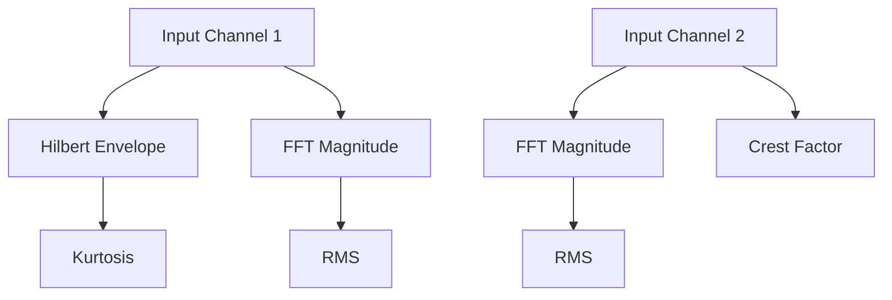

```mermaid
flowchart TD
    ch1[Input Channel 1]
    ch2[Input Channel 2]
    hilbert_envelope_01_ch1[Hilbert Envelope]
    fft_03_ch1[FFT Magnitude]
    fft_05_ch2[FFT Magnitude]
    crest_factor_07_ch2[Crest Factor]
    kurtosis_02_hilbert_envelope_01_ch1[Kurtosis]
    rms_04_fft_03_ch1[RMS]
    rms_06_fft_05_ch2[RMS]
    ch1 --> hilbert_envelope_01_ch1
    ch1 --> fft_03_ch1
    ch2 --> fft_05_ch2
    ch2 --> crest_factor_07_ch2
    hilbert_envelope_01_ch1 --> kurtosis_02_hilbert_envelope_01_ch1
    fft_03_ch1 --> rms_04_fft_03_ch1
    fft_05_ch2 --> rms_06_fft_05_ch2
```
