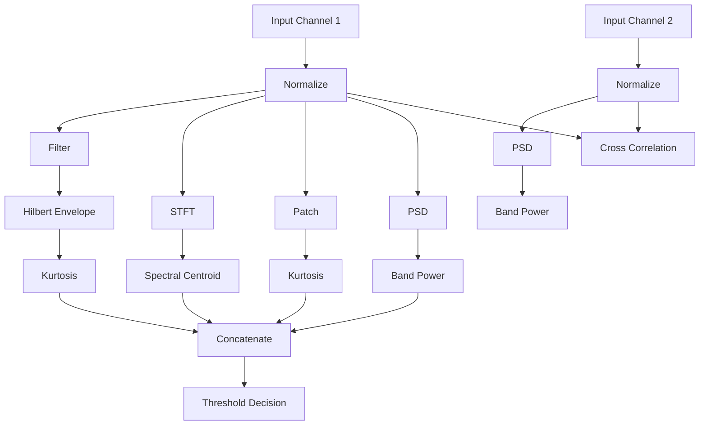

```mermaid
flowchart TD
    ch1[Input Channel 1]
    ch2[Input Channel 2]
    normalize_01_ch1[Normalize]
    normalize_02_ch2[Normalize]
    filter_03_normalize_01_ch1[Filter]
    stft_06_normalize_01_ch1[STFT]
    patch_08_normalize_01_ch1[Patch]
    psd_10_normalize_01_ch1[PSD]
    psd_12_normalize_02_ch2[PSD]
    cross_correlation_14_normalize_01_ch1__normalize_02_ch2[Cross Correlation]
    hilbert_envelope_04_filter_03_normalize_01_ch1[Hilbert Envelope]
    spectral_centroid_07_stft_06_normalize_01_ch1[Spectral Centroid]
    kurtosis_09_patch_08_normalize_01_ch1[Kurtosis]
    band_power_11_psd_10_normalize_01_ch1[Band Power]
    band_power_13_psd_12_normalize_02_ch2[Band Power]
    kurtosis_05_hilbert_envelope_04_filter_03_normalize_01_ch1[Kurtosis]
    concatenate_15_kurtosis_05_hilbert_envelope_04_filter_03_normalize_01_ch1__spectral_centroid_07_stft_06_normalize_01_ch1__kurtosis_09_patch_08_normalize_01_ch1__band_power_11_psd_10_normalize_01_ch1[Concatenate]
    threshold_16_concatenate_15_kurtosis_05_hilbert_envelope_04_filter_03_normalize_01_ch1__spectral_centroid_07_stft_06_normalize_01_ch1__kurtosis_09_patch_08_normalize_01_ch1__band_power_11_psd_10_normalize_01_ch1[Threshold Decision]
    ch1 --> normalize_01_ch1
    ch2 --> normalize_02_ch2
    normalize_01_ch1 --> filter_03_normalize_01_ch1
    normalize_01_ch1 --> stft_06_normalize_01_ch1
    normalize_01_ch1 --> patch_08_normalize_01_ch1
    normalize_01_ch1 --> psd_10_normalize_01_ch1
    normalize_01_ch1 --> cross_correlation_14_normalize_01_ch1__normalize_02_ch2
    normalize_02_ch2 --> psd_12_normalize_02_ch2
    normalize_02_ch2 --> cross_correlation_14_normalize_01_ch1__normalize_02_ch2
    filter_03_normalize_01_ch1 --> hilbert_envelope_04_filter_03_normalize_01_ch1
    hilbert_envelope_04_filter_03_normalize_01_ch1 --> kurtosis_05_hilbert_envelope_04_filter_03_normalize_01_ch1
    kurtosis_05_hilbert_envelope_04_filter_03_normalize_01_ch1 --> concatenate_15_kurtosis_05_hilbert_envelope_04_filter_03_normalize_01_ch1__spectral_centroid_07_stft_06_normalize_01_ch1__kurtosis_09_patch_08_normalize_01_ch1__band_power_11_psd_10_normalize_01_ch1
    stft_06_normalize_01_ch1 --> spectral_centroid_07_stft_06_normalize_01_ch1
    spectral_centroid_07_stft_06_normalize_01_ch1 --> concatenate_15_kurtosis_05_hilbert_envelope_04_filter_03_normalize_01_ch1__spectral_centroid_07_stft_06_normalize_01_ch1__kurtosis_09_patch_08_normalize_01_ch1__band_power_11_psd_10_normalize_01_ch1
    patch_08_normalize_01_ch1 --> kurtosis_09_patch_08_normalize_01_ch1
    kurtosis_09_patch_08_normalize_01_ch1 --> concatenate_15_kurtosis_05_hilbert_envelope_04_filter_03_normalize_01_ch1__spectral_centroid_07_stft_06_normalize_01_ch1__kurtosis_09_patch_08_normalize_01_ch1__band_power_11_psd_10_normalize_01_ch1
    psd_10_normalize_01_ch1 --> band_power_11_psd_10_normalize_01_ch1
    band_power_11_psd_10_normalize_01_ch1 --> concatenate_15_kurtosis_05_hilbert_envelope_04_filter_03_normalize_01_ch1__spectral_centroid_07_stft_06_normalize_01_ch1__kurtosis_09_patch_08_normalize_01_ch1__band_power_11_psd_10_normalize_01_ch1
    psd_12_normalize_02_ch2 --> band_power_13_psd_12_normalize_02_ch2
    concatenate_15_kurtosis_05_hilbert_envelope_04_filter_03_normalize_01_ch1__spectral_centroid_07_stft_06_normalize_01_ch1__kurtosis_09_patch_08_normalize_01_ch1__band_power_11_psd_10_normalize_01_ch1 --> threshold_16_concatenate_15_kurtosis_05_hilbert_envelope_04_filter_03_normalize_01_ch1__spectral_centroid_07_stft_06_normalize_01_ch1__kurtosis_09_patch_08_normalize_01_ch1__band_power_11_psd_10_normalize_01_ch1
```
